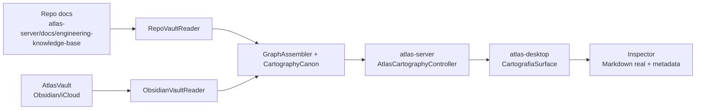

# ADR-0003 · Cartografia do Atlas Desktop

Status: accepted · 2026-05-13

## Resumo

A Cartografia do Atlas Desktop e a interface navegavel da verdade canonica do
Atlas. Ela nao e editor, nao e Obsidian reimplementado e nao e uma copia do
Vault. Ela le fontes reais, mostra origem e caminho de cada peca, permite
navegar do universo ate a engrenagem e torna verificavel o que foi documentado.

Este ADR define o que a Cartografia e. O contrato obrigatorio de escala,
modularizacao e refatoracao vive em
`docs/architecture/0006-cartography-surface-scalability-contract.md`.

Frase canonica:

```text
A documentacao oficial e a verdade. A Cartografia e a interface que torna essa
verdade legivel, navegavel e verificavel sem depender da interpretacao do agente.
```

## Problema

Hoje, para entender o Atlas, o operador precisa pedir para uma IA ler docs,
interpretar e responder. Isso cria tres riscos:

- interpretacao errada ou incompleta;
- drift entre documentacao real e representacao visual;
- dependencia do agente como intermediario para conferir a verdade.

A Cartografia resolve isso lendo diretamente as fontes canonicas e exibindo o
conteudo real do arquivo `.md` no inspector.

## Fontes de verdade

| Fonte | Conteudo | Autoridade |
|---|---|---|
| `atlas-server/docs/engineering-knowledge-base/` | Arquitetura tecnica, Kernel, Forge, Governance, Evidence, contratos | Fonte oficial tecnica |
| `AtlasVault` no iCloud/Obsidian | Memoria humana, filosofia, livros, historias, principios, notas reflexivas | Segundo cerebro compartilhado |
| `atlas-server` API | Grafo agregado, notas, mudancas recentes, status de leitura | Servico de leitura |
| `atlas-desktop` | Visualizacao, navegacao, inspector, interacoes locais | Cliente read-only |

Regra principal: a Cartografia nao sincroniza uma copia. Ela renderiza leitura
direta de repo docs + Vault. Cada node precisa expor `source` e `source_path`.

## Nao objetivos

- Nao editar arquivos pela Cartografia v1.
- Nao escrever no Obsidian.
- Nao substituir o Obsidian como cofre.
- Nao substituir `docs/engineering-knowledge-base` como documentacao oficial.
- Nao mostrar dado inventado quando uma fonte esta ausente.
- Nao marcar node como implementado sem evidencia real.

## Arquitetura



## Contratos HTTP

### `GET /atlas-cartography/graph`

Retorna o grafo navegavel. O Desktop adapta esse payload para
`CartographyGraph`.

Campos esperados:

| Campo | Descricao |
|---|---|
| `universe` | Continentes macro: Atlas, Memoria, Obras, Forge, Filosofia, Gargalos |
| `pipeline` | Etapas do Atlas AI Kernel Pipeline |
| `lanes` | Planos laterais: Domain Plane, Capabilities, HKS, Evidence Loop, Doc OS |
| `connections` | Arestas entre steps/lanes |
| `audit` | Contagem, fontes, ausencias, paths e sinais de saude |

### `GET /atlas-cartography/note/{graph_id}`

Retorna o markdown real do arquivo associado ao node.

Campos esperados:

| Campo | Descricao |
|---|---|
| `graph_id` | ID canonico do node |
| `exists` | Se existe arquivo real associado |
| `source` | `repo`, `vault` ou `null` |
| `source_path` | Caminho relativo real |
| `frontmatter` | Frontmatter bruto |
| `body` | Corpo markdown sem frontmatter |
| `modified_at` | Mtime em ISO-8601 |

### `GET /atlas-cartography/recent-changes`

Retorna mudancas recentes para a timeline. Mistura git log do repo e mtime de
arquivos repo/vault.

Campos esperados por mudanca:

| Campo | Descricao |
|---|---|
| `graph_id` | Node associado |
| `name` | Nome humano |
| `action` | `edited`, `saved`, `created`, `deleted` quando suportado |
| `author` | Autor do commit ou `filesystem` |
| `source` | `repo` ou `vault` |
| `path` | Caminho do arquivo |
| `timestamp` | Unix timestamp |
| `seconds_ago` | Idade calculada pelo servidor |
| `commit` | SHA curto quando vier de git |

## Modelo de dados do Desktop

Tipos vivem em `packages/atlas-domain/src/cartography.ts` e sao exportados por
`packages/atlas-domain/src/index.ts`.

Modelo principal:

| Tipo | Papel |
|---|---|
| `CartographyGraph` | Snapshot completo do grafo |
| `Continent` | Continente macro do universo |
| `PipelineStep` | Etapa numerada do Kernel Pipeline |
| `Lane` | Plano lateral do fluxo |
| `LateralNode` | Node dentro de uma lane |
| `Connection` | Relacao visual entre nodes |
| `CartographyAtom` | Forma normalizada usada pelo inspector |
| `CartographyNote` | Markdown real de um arquivo |
| `RecentChange` | Evento da timeline |
| `GraphAudit` | Saude do grafo |

## Maquina de estados da interface

| Estado | Funcao | Entrada | Saida |
|---|---|---|---|
| `universe` | Ver todos os continentes | Botao universo/fit | Selecionar continente |
| `system` | Ver sistemas de um continente | Selecionar continente nao-Atlas | Entrar no fluxo quando houver |
| `flow` | Ver Atlas AI Kernel Pipeline completo | Default para Atlas | Isolar lane ou abrir engrenagem |
| `gear` | Foco em uma engrenagem | Click em atom | Inspector completo + satelites |
| `subflow` | Subcomponentes da engrenagem | Botao subfluxo | Voltar ao foco |

Regras:

- `ESC` deve voltar um nivel.
- Search abre o primeiro node encontrado em `gear`.
- Hover atualiza inspector sem trocar estado.
- Click abre `gear`.
- Isolate escurece o restante sem perder contexto do mapa.

## Layout visual

Componentes principais:

| Arquivo | Responsabilidade |
|---|---|
| `CartografiaSurface.tsx` | Root da tela, compoe viewport, scenes, inspector e floaters |
| `useCartografia.ts` | Estado, polling, cache de notas, navegacao |
| `useCartografiaViewport.ts` | Pan, zoom, fit e transform do canvas |
| `UniverseScene.tsx` | Continentes macro |
| `SystemScene.tsx` | Sistemas dentro do continente |
| `FlowScene.tsx` | Pipeline, lanes e conexoes |
| `GearScene.tsx` | Foco em uma engrenagem |
| `SubflowScene.tsx` | Subcomponentes |
| `Inspector.tsx` | Metadata, evidence, risks, next action e markdown real |
| `TimelineFloater.tsx` | Mudancas recentes |
| `Minimap.tsx` | Navegacao macro |
| `Trails.tsx` | SVG de conexoes |
| `cartografia.css` | Sistema visual da Cartografia |

## Comportamento read-only

A Cartografia v1 so pode executar acoes locais de leitura:

- abrir arquivo repo no editor local quando houver suporte;
- abrir nota Vault via `obsidian://`;
- revelar arquivo no Finder;
- copiar path canonico;
- navegar pelo grafo;
- atualizar dados por polling.

Qualquer escrita precisa acontecer fora da Cartografia:

```text
Usuario pede mudanca -> agente edita doc real -> servidor detecta -> Cartografia mostra arquivo real atualizado.
```

## Estados vazios e erro

| Situacao | UI correta |
|---|---|
| Kernel offline | Overlay com erro acionavel e fonte indisponivel |
| Repo docs nao legivel | Node `repo` marcado como `missing_source` |
| Vault nao legivel | Continentes vault aparecem degradados, sem inventar notas |
| Nota ausente | Inspector mostra `Fonte ausente`, path esperado e proxima acao |
| Markdown vazio | Mostrar metadata e aviso `arquivo sem corpo` |
| Timeline vazia | Mostrar `sem mudancas recentes`, nao simular evento |

## Polling e tempo real

Estado atual:

- `useCartografia` faz polling a cada 5s em `graph` e `recent-changes`.
- Timeline incrementa `secondsAgo` localmente a cada 1s.
- Notas sao carregadas lazy por `graph_id`.

Proxima evolucao:

- trocar polling por SSE ou watcher emitido pelo `atlas-server`;
- invalidar `noteCache` quando `modified_at` mudar;
- distinguir `file_saved`, `git_commit`, `server_event`, `vault_sync`.

## Auditoria do grafo

O backend deve produzir `audit` suficiente para a tela responder:

- quantos nodes foram encontrados por fonte;
- quantos nodes esperados estao ausentes;
- quais paths estao quebrados;
- quais nodes nao tem `graph_id`;
- quais links apontam para nodes inexistentes;
- quando o snapshot foi gerado;
- tempo de leitura de repo e vault.

Sem audit, a Cartografia vira uma tela bonita sem confianca operacional.

## Criterios de aceite v1

- Abre em `Cartografia #1` sem mock.
- Mostra `atlas desktop · vX` e estado do Kernel.
- `GET /atlas-cartography/graph` alimenta a tela.
- Nodes repo e vault aparecem com badge de fonte.
- Click em node abre inspector.
- Inspector mostra markdown real via `/note/{graph_id}`.
- Search encontra node por nome ou `graph_id`.
- Timeline mostra mtime/git real.
- Node ausente aparece como ausente, nao como implementado.
- Cartografia nao tem rota de escrita.
- `npm run build` passa.

## Backlog priorizado

### P0 · Confiabilidade

- Mostrar `audit` completo no inspector/overlay.
- Expor erro real quando endpoint falhar.
- Remover qualquer fallback hardcoded que pareca dado real.
- Garantir que `CartographyGraph` invalido nao quebre a tela.

### P1 · Navegacao

- Breadcrumb clicavel por nivel.
- Search com lista de resultados, nao apenas primeiro hit.
- Filtros por fonte: repo, vault, mixed, missing.
- Filtros por status: active, building, planned, future, missing.

### P2 · Live-doc

- SSE para mudancas de arquivo.
- Badge `atualizado ha Xs` em node alterado.
- Invalidacao automatica de nota em cache.
- Timeline com agrupamento por fonte/evento.

### P3 · Acoes locais

- `Abrir no editor` para repo doc.
- `Abrir no Obsidian` para vault note.
- `Revelar no Finder`.
- `Copiar path`.

### P4 · Camadas semanticas

- Visao por dependencia.
- Visao por evidencia.
- Visao por gargalos.
- Visao por maturidade.
- Visao por fluxo operacional.

## Decisoes em aberto

| Decisao | Opcoes | Recomendacao |
|---|---|---|
| Live updates | polling, SSE, websocket | SSE no server local |
| Editor repo | Cursor URI, VS Code URI, Finder | comecar por Finder + configurar editor depois |
| Obsidian open | `obsidian://open` | usar apenas para `source=vault` |
| Cache | TTL Laravel, mtime key, no cache | TTL curto + invalida por mtime |
| Layout | posicoes canonicas, force graph, misto | posicoes canonicas para fluxo; force graph so para visoes exploratorias |

## Relação com ADR-0002

ADR-0002 define prontidao profissional do Atlas Desktop inteiro. Este documento
detalha apenas a Cartografia e deve ser usado como contrato de implementacao da
tela `Cartografia #1`.
