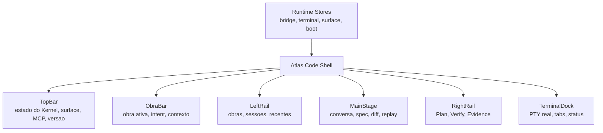

# ADR-0004 · Atlas Code Surface Scalability Contract

Status: accepted · 2026-05-13

Este documento define a arquitetura rigorosa da tela `Code` do Atlas Desktop
para ela escalar ate uma cabine operacional enterprise. A meta nao e apenas
organizar componentes React. A meta e impedir que Atlas Code vire uma tela
bonita, fragil e impossivel de evoluir quando houver muitas obras, sessoes,
agentes, terminals, receipts, plans, diffs, gates, evidence, MCP, cartografia e
controle local do Mac ao mesmo tempo.

Frase canonica:

```text
Atlas Code e a cabine operacional. Kernel decide. Desktop mostra, comanda,
assina, observa e nunca finge estado.
```

## Problema

A tela Code precisa crescer para cobrir uma nova categoria de produto:
Engineering Operations System para construcao de software por IA. Isso cria
pressao em cinco direcoes:

- muita informacao operacional simultanea;
- muitas fontes de verdade: Kernel, PTY, filesystem, docs, Vault, MCP, Ledger;
- varios modos de trabalho: conversa, spec, plano, execucao, verificacao,
  evidencia, terminal e cartografia;
- necessidade de feedback instantaneo: o operador precisa saber se pode agir;
- risco de drift visual: a UI parecer pronta quando o backend, terminal ou
  receipt ainda nao estao prontos.

Sem uma arquitetura de tela explicita, cada nova feature tende a ocupar o
espaco de outra: terminal cobre `Plan/Verify/Evidence`, painel direito some,
composer fica pequeno demais, conversas perdem contexto, ou o estado real do
comando fica ambiguo.

## Decisao

A tela Code deve ser tratada como um **Operational Shell** composto por regioes
estaveis, surfaces registradas, panels encaixaveis e protocolos de runtime.
Nenhum componente pode ser implementado como "um bloco visual que toma a tela"
sem declarar:

- qual regiao ocupa;
- qual estado consome;
- qual fonte e autoridade;
- como degrada quando a fonte falha;
- como convive com terminal, right rail e conversa;
- quais contratos de aceite provam que nao quebrou o shell.

## Principios nao negociaveis

1. `Plan / Verify / Evidence` nunca somem.
   Eles sao a coluna operacional de governanca da obra. Terminal, diffs,
   learning, MCP e qualquer painel novo devem coexistir com eles.

2. O terminal nunca finge prompt.
   O shell real emite prompt real. A UI pode detectar, destacar e diagnosticar,
   mas nao pode inventar que o comando terminou.

3. Vazio honesto vence mock bonito.
   Se o Kernel, PTY, MCP, Vault ou docs nao responderem, a tela mostra motivo,
   proxima acao e status degradado.

4. Conversa nao e log solto.
   A conversa e a trilha de direcao da Obra. Mensagem local pendente deve ser
   reconciliada com thread/trace real do Kernel.

5. O painel central pertence ao trabalho atual.
   Ele pode mostrar conversa, spec, diff, mapa de execucao, replay ou review,
   mas sempre com Obra, sessao e source claros.

6. A coluna direita pertence a decisao e evidencia.
   Ela mostra recibos, gates, evidence, plan, verify, learning e estado local.
   Paineis auxiliares podem entrar abaixo ou dentro dela, mas nao substitui-la.

7. Layout e runtime sao separados.
   Mover terminal para baixo ou para direita nao pode criar outra sessao PTY,
   reiniciar shell, perder estado ou desmontar paineis criticos.

8. Cada estado precisa ser auditavel.
   Se a tela diz `executando`, `pronto`, `falhou`, `assinado`, `aplicado` ou
   `sincronizado`, isso vem de protocolo real, nao de heuristica visual.

## Modelo mental da tela



O shell e dono do grid. Componentes internos nao podem redefinir o grid global,
usar `position: fixed` para cobrir regioes canonicas ou inferir tamanhos fora
dos tokens do shell.

## Regioes canonicas

| Regiao | Arquivo atual | Responsabilidade | Pode sumir? |
|---|---|---|---|
| `topbar` | `apps/desktop/src/shell/topbar/TopBar.tsx` | Kernel, MCP, surface switch, versao, diagnostico global | Nao |
| `obra` | `apps/desktop/src/surfaces/code/obra/ObraBar.tsx` | Criar/selecionar Obra, objetivo, intent operacional | Nao em Code |
| `left` | `apps/desktop/src/surfaces/code/leftRail/LeftRail.tsx` | Navegacao de obras, sessoes e recentes | Pode colapsar, nao desmontar estado |
| `stage` | `apps/desktop/src/surfaces/code/stage/MainStage.tsx` | Trabalho principal: conversa/spec/diff/replay | Nao |
| `right` | `apps/desktop/src/surfaces/code/panels/RightRail.tsx` | Plano, verificacao, evidencia, receipts, gates | Nao |
| `terminal` | `apps/desktop/src/surfaces/code/terminal/TerminalDock.tsx` | PTY real e observabilidade local | Pode dockar, colapsar ou maximizar |

Regra: toda nova feature deve escolher uma destas regioes ou declarar uma nova
surface registrada. Nao existe feature "flutuante" sem contrato.

## Camadas da arquitetura

### 1. Shell

O shell define:

- regioes globais;
- tokens de tamanho;
- regras de docking;
- responsive behavior;
- atalhos globais;
- montagem/desmontagem das surfaces.

Estado atual:

```text
apps/desktop/src/shell/
  AtlasShell.tsx
  ErrorBoundary.tsx
  SurfaceHost.tsx
  surfaceRegistry.ts
  topbar/
    TopBar.tsx
    BrandBlock.tsx
    SurfaceSwitcher.tsx
    KernelPill.tsx
    KernelDiagnostic.tsx
    McpPill.tsx
    BridgeBadge.tsx
```

O `App.tsx` deve permanecer pequeno: escolher surface, injetar bridge/kernel e
renderizar `AtlasShell`. Qualquer nova area global entra em `shell/`, nao em
`components/` e nao diretamente em `App.tsx`.

### 2. Surface Registry

Atlas Desktop tera mais surfaces alem de `Code` e `Cartografia`.
Exemplos futuros: `Inbox`, `Historico`, `Agenda`, `MCP`, `Receipts`, `Settings`.

Contrato atual:

```ts
type AtlasSurfaceDefinition = {
  id: Surface
  label: string
  shortcut: string
  sub: string
  authority: 'kernel' | 'local' | 'repo' | 'vault'
  requiresKernel: boolean
}
```

Regra: surface nova nao entra direto no `App.tsx`. Ela entra no registry e o
shell decide como montar.

### 3. Panel System

Paineis sao blocos operacionais dentro das regioes. Exemplo:

- `DecisionReceiptPanel`;
- `QualityGatesPanel`;
- `EvidenceLedgerPanel`;
- `TerminalPanel`;
- `DiffReviewPanel`;
- `McpCallsPanel`;
- `LearningProposalsPanel`.

Contrato de um panel:

```ts
type AtlasPanelDefinition = {
  id: string
  region: 'left' | 'stage' | 'right' | 'terminal'
  priority: number
  minSize: number
  defaultSize?: number
  authority: 'kernel' | 'local' | 'repo' | 'vault'
  emptyState: 'honest-empty-required'
}
```

Paineis nao podem acessar CSS global para empurrar outras regioes. Eles recebem
slot, size e state do Shell.

### 4. Runtime Stores

Estados de runtime precisam ser pequenos, explicitos e focados.

| Store | Papel | Nao deve fazer |
|---|---|---|
| `useSurface` | Surface ativa | Guardar dados de negocio |
| `useBridge` | Dados reais do Kernel | Guardar layout local |
| `useTerminalStore` | Layout persistente de terminal/tabs | Detectar execucao |
| `useTerminalRuntime` | Estado vivo do PTY | Persistir preferencias |
| futuro `usePanelStore` | Colapso, ordem e tamanho de panels | Chamar backend |
| futuro `useCommandCenter` | Atalhos e paleta de comandos | Renderizar UI |

Regra: persistencia local e runtime ao vivo nao ficam no mesmo store.

### 5. Protocolos

O Atlas Code precisa tratar certos fluxos como protocolos, nao como texto.

| Protocolo | Fonte | Sinais minimos |
|---|---|---|
| Terminal Prompt | zsh + OSC 133 | `C`, `D`, `A`, `B`, cwd, exit, duration |
| Kernel Boot | atlas-tauri + server | booting, ready, failed, repair_hint |
| Obra | atlas-server | project id, objective, status, workspace |
| Thread | atlas-server | messages, trace, stream/polling |
| Receipt | Kernel + signer local | payload, hash, signature, ledger event |
| Gates | atlas-server | queued, running, passed, failed, evidence |
| Cartografia | atlas-server readers | source, path, checksum, audit |
| MCP | atlas-server | tools, calls, freshness, degraded reason |

Se um fluxo nao tem protocolo, ele ainda nao pode ser base de decisao critica.

## Layout enterprise alvo

### Modo normal

```text
┌──────────────────────────────────────────────────────────────┐
│ TopBar                                                       │
├──────────────────────────────────────────────────────────────┤
│ ObraBar                                                      │
├──────────────┬───────────────────────────────┬───────────────┤
│ LeftRail     │ MainStage                     │ RightRail     │
│              │ conversa/spec/diff            │ Plan/Verify   │
│              │                               │ Evidence      │
├──────────────┴───────────────────────────────┴───────────────┤
│ TerminalDock bottom · PTY real                               │
└──────────────────────────────────────────────────────────────┘
```

### Terminal dockado na direita

```text
┌──────────────────────────────────────────────────────────────┐
│ TopBar                                                       │
├──────────────────────────────────────────────────────────────┤
│ ObraBar                                                      │
├──────────────┬───────────────────────────────┬───────────────┤
│ LeftRail     │ MainStage                     │ RightRail     │
│ ate o fim    │ ate o fim                     │ Plan/Verify   │
│              │                               │ Evidence      │
│              │                               │               │
│              │                               ├───────────────┤
│              │                               │ TerminalDock  │
│              │                               │ lateral       │
└──────────────┴───────────────────────────────┴───────────────┘
```

Regra fundamental: no modo lateral, o terminal e filho visual da coluna direita,
mas nao substitui `RightRail`. O conteudo de `RightRail` deve receber padding
inferior suficiente para nao ficar escondido atras do terminal.

## Contrato do terminal

O terminal e uma infraestrutura de produto, nao um widget decorativo.

### Estados obrigatorios

| Estado | Fonte | UI correta |
|---|---|---|
| `opening` | Tauri command | `abrindo PTY real...` |
| `ready` | OSC `B` | prompt visivel + status `pronto` |
| `running` | OSC `C` | dot ativo + `executando · Ns` + botao parar |
| `completed` | OSC `D;0` seguido de `B` | `concluido · exit 0 · duracao` |
| `failed` | OSC `D;N` seguido de `B` | `falhou · exit N · duracao` |
| `prompt-pending` | `D` sem `B` | `finalizando prompt...`, nunca `rodando` |
| `dead` | PTY exit | `sessao encerrada`, acao reabrir |

### Prompt canonico

O prompt visual deve ser previsivel:

```text
~/pasta · branch via node vX · docker
❯ cursor
```

Campos opcionais aparecem apenas quando existem:

- branch Git;
- runtime Node quando detectado;
- Docker quando `docker-compose.yml`, `compose.yml` ou `Dockerfile` existir;
- duracao do ultimo comando na status bar, nao em right prompt instavel.

### Regras de confianca

- Depois de `ls`, `cd`, `zi`, `pwd`, `false`, `sleep`, `npm run build`, o
  usuario sempre precisa saber se o terminal esta pronto para o proximo comando.
- `inputReady=true` so pode vir do marcador `B`.
- `running=false` pode vir de `D`, mas a UI deve diferenciar comando terminado
  de prompt ainda nao pronto.
- `term.refresh()` e `scrollToBottom()` sao correcoes visuais permitidas; prompt
  artificial escrito pelo frontend nao e permitido.
- Abrir, fechar, dockar ou maximizar o terminal nao pode duplicar PTY.

## Contrato do RightRail

`RightRail` e a coluna de decisao operacional. Ela deve escalar como um conjunto
de tabs e panels.

Tabs canonicas:

- `Plan`: receipt, plano, packets, scope, contrato de execucao;
- `Verify`: gates, checks, repair loop, regressao visual, testes;
- `Evidence`: ledger, traces, artifacts, diff proof, links.

Regras:

- tabs sempre visiveis;
- conteudo rolavel;
- terminal lateral entra abaixo, nao por cima;
- linhas longas devem quebrar com ellipsis ou wrap controlado;
- actions destrutivas precisam confirmar ou exigir receipt;
- nenhum numero aparece sem fonte real.

## Contrato do MainStage

`MainStage` e o espaco principal de trabalho humano + Atlas.

Ele deve suportar modos internos:

| Modo | Quando usar | Fonte |
|---|---|---|
| `conversation` | direcao natural da obra | thread real do Kernel |
| `spec` | SDD/spec compiler | artifacts do Kernel |
| `plan` | plano executavel | packets/run plan |
| `diff` | review de mudanca | patch real |
| `replay` | auditar execucao | receipt/evidence |
| `repair` | falha/gate/retry | repair loop |

Regra: o composer nao e um input solto. Ele sempre envia intent para uma Obra
ativa, com contexto opcional e policy do Kernel.

## Contrato do LeftRail

`LeftRail` e navegacao operacional. Ele nao e arquivo explorer.

Deve mostrar:

- obras;
- sessoes em curso;
- recentes;
- alertas de bloqueio;
- talvez worktrees/branches no futuro.

Regras:

- pode colapsar para ganhar espaco;
- nao pode perder selecao ativa;
- nao pode criar obra local falsa;
- item recente precisa apontar para thread, trace, evidence ou path real.

## Contrato de dados

Toda area da tela precisa declarar fonte.

| Area visual | Fonte primaria |
|---|---|
| Kernel status | `atlas-tauri` + `/health` + `/atlas-code/boot` |
| Obras | `atlas-server` |
| Mensagens | `atlas-server` threads/interactions |
| SDD | `atlas-server` artifacts |
| Receipt | `atlas-server` decision + `atlas-receipts` assinatura |
| Gates | `atlas-server` tools/gates |
| Evidence | `atlas-server` ledger |
| Terminal | `atlas-platform` PTY |
| CWD/exit/duracao | OSC protocol do shell |
| Cartografia | repo docs + AtlasVault via server |
| MCP | `atlas-server` MCP status |

Proibido: usar array mockado em surface de producao sem label explicito de
`sample`, `demo` ou `fixture`.

## Estados de degradacao

| Falha | UI enterprise |
|---|---|
| Kernel offline | topo vermelho discreto + motivo + retry + logs curtos |
| Bridge offline | tela ainda abre, mas actions reais ficam disabled |
| PTY indisponivel | terminal mostra causa e acao; nao fica preto/vazio |
| Prompt nao voltou | status `finalizando prompt...`; diagnostico se passar timeout |
| Vault ausente | Cartografia marca fonte ausente, nao inventa nodes |
| Doc repo ausente | Cartografia mostra path quebrado e audit |
| Receipt sem assinatura | mostra aguardando assinatura, nao "assinado" |
| Gate falhou | evidencia + repair action + bloqueio claro |

## Estrutura de pastas canonica

```text
apps/desktop/src/
  shell/
    AtlasShell.tsx
    ErrorBoundary.tsx
    SurfaceHost.tsx
    surfaceRegistry.ts
    topbar/
  surfaces/
    code/
      CodeSurface.tsx
      CodeSurfaceLayout.tsx
      leftRail/
      obra/
      panels/
      stage/
      terminal/
    cartografia/
      CartografiaSurface.tsx
  components/
    apenas fachadas legadas para compatibilidade incremental
```

Regra de import:

```text
App -> shell -> surfaces -> modulos internos
components -> shell/surfaces como fachada legada
surfaces/code -> NUNCA importa components/
shell -> NUNCA importa surfaces/code internals
```

`components/` nao e mais o lugar de evolucao do produto. Se uma feature nova
precisa crescer, ela nasce em `shell/` ou `surfaces/<surface>/`.

## Onde adicionar cada tipo de feature

| Feature nova | Lugar certo | Regra |
|---|---|---|
| Surface nova (`Inbox`, `Historico`) | `surfaceRegistry.ts` + `surfaces/<nome>/` | Nao editar `App.tsx` para montar direto |
| Item novo na esquerda | `leftRail/leftRailRegistry.tsx` | Nao editar `LeftRail.tsx` com `if` local |
| Tab nova na direita | `panels/rightRailRegistry.tsx` | Nao remover `Plan/Verify/Evidence` |
| Modo novo do palco | `stage/mainStageRegistry.tsx` | Composer continua estavel |
| Funcao nova do terminal | `terminal/` ou `terminal/session/` | Nao misturar com layout do palco |
| Diagnostico global | `shell/topbar/` ou `shell/` | Nao colocar regra de obra no topo |
| Estado vivo de backend | `hooks/useBridge.ts` ou bridge contract | Nao buscar direto em componente visual |
| Estado vivo de PTY | `state/terminalRuntime.ts` | Nao persistir como preferencia |
| Preferencia de layout | `state/terminalStore.ts` ou futuro `panelStore` | Nao inferir de DOM |

## Ordem de implementacao recomendada atualizada

1. Manter `App.tsx` pequeno.
   Ele so escolhe surface, injeta bridge/kernel/boot e monta shell.

2. Evoluir por registry.
   LeftRail, RightRail e MainStage crescem por registry, nao por blocos
   hardcoded dentro do host.

3. Estabilizar terminal como protocolo.
   Sem terminal confiavel, Atlas Code parece amador mesmo quando o backend esta
   correto.

4. Separar stores persistentes de stores runtime.
   Terminal layout, terminal execution, panel layout e bridge nao se misturam.

5. Adicionar contratos de teste visual e estado.
   Cada bug que apareceu no terminal vira cenario de regressao.

6. Extrair estilos inline restantes.
   Estilo inline so e aceitavel para valor dinamico inevitavel. Layout, spacing,
   typography e estado visual pertencem ao CSS/tokens.

## Checklist de review para qualquer PR na tela Code

Antes de aceitar qualquer mudanca:

- O arquivo alterado pertence ao owner certo (`shell`, `surface`, `state`,
  `bridge`, `platform`)?
- A mudanca adiciona feature via registry quando existe registry?
- `Plan / Verify / Evidence` continuam presentes?
- `MainStage` continua com composer estavel?
- O terminal nao recria PTY ao mudar layout?
- Dados novos mostram fonte real ou vazio honesto?
- Estados como `running`, `signed`, `applied`, `synced` vem de contrato real?
- Erro e vazio tem proxima acao clara?
- Nao existe import de `components/` dentro de `surfaces/code/`?
- Nao existe mock silencioso em surface de producao?
- `npm run build` passa?
- `git diff --check` passa?
- Se tocou PTY/Rust, teste de PTY passa?

## Definition of Done para qualquer mudanca na tela Code

Uma mudanca na tela Code so esta pronta quando:

- `Plan / Verify / Evidence` continuam visiveis;
- MainStage nao perde composer;
- terminal nao duplica sessao;
- terminal informa `running/ready/failed`;
- dock bottom e dock right funcionam quando a mudanca tocar terminal/layout;
- resize nao quebra scroll/foco;
- nenhum dado novo e mock silencioso;
- estado vazio e erro sao acionaveis;
- `npm run build` passa;
- testes relevantes de Rust/PTY passam quando a mudanca tocar terminal;
- `git diff --check` passa.

## Testes obrigatorios por camada

| Camada | Teste |
|---|---|
| Shell layout | alternar Code/Cartografia sem desmontar estado indevido |
| TopBar | kernel ready/failed/unconfigured com diagnostico acionavel |
| RightRail | trocar Plan/Verify/Evidence com terminal lateral ativo |
| MainStage | trocar modo sem perder composer ou obra ativa |
| Terminal layout | bottom -> right -> bottom sem perder PTY |
| Terminal protocol | `ls`, `cd ..`, `zi`, `pwd`, `false`, `sleep 2` |
| Terminal performance | comando rapido volta para `ready` em poucos frames |
| Bridge | criar Obra real e recarregar sem item falso |
| Composer | envio rejeitado pelo backend remove estado pendente |
| Receipt | nao assinado, assinado, assinatura invalida |
| Evidence | vazio real, evento real, erro real |

## Anti-patterns proibidos

- Usar `position: fixed` para painel operacional sem registro no Shell.
- Substituir `RightRail` para encaixar terminal.
- Escrever prompt artificial no buffer do terminal.
- Usar `setTimeout` longo para mascarar estado de execucao.
- Recriar PTY ao mudar layout.
- Fazer componente buscar backend diretamente sem passar pelo bridge/contract.
- Importar de `components/` dentro de `surfaces/code`.
- Criar arquivos novos de produto em `components/`.
- Colocar business logic em CSS/layout.
- Persistir estado vivo de comando no localStorage.
- Mostrar `implemented`, `signed`, `applied`, `synced` sem evidencia real.
- Criar mock como se fosse dado de producao.

## Estado atual da tela

Observado em 2026-05-13:

- `App.tsx` ja esta reduzido a bootstrap de shell/surface.
- `shell/` existe e possui `AtlasShell`, `SurfaceHost`, `surfaceRegistry`,
  `ErrorBoundary` e `topbar/`.
- `CodeSurface` compoe slots estaveis por `CodeSurfaceLayout`.
- `LeftRail`, `RightRail`, `MainStage`, `ObraBar` e `Terminal` vivem em
  `surfaces/code/`.
- `components/` e fachada legada; nao deve receber feature nova.
- `RightRail` ja usa registry de panels.
- `LeftRail` ja usa registry de secoes.
- `MainStage` ja usa registry de modos.
- `Terminal` ja separa layout, toolbar, status, prompt protocol, xterm,
  resize e comandos globais.
- `TerminalRuntime` separa `running`, `inputReady`, `lastExit` e duracao.
- Ainda falta blindar visualmente todos os cenarios reais de prompt rapido,
  comando longo e falha de comando com regressao automatizada.
- Ainda existem estilos inline em alguns panels de Code; devem ser removidos
  progressivamente para tokens CSS.

Conclusao: a arquitetura saiu de MVP visual para base composable. O proximo
salto de qualidade e transformar confiabilidade operacional em testes de
regressao e remover estilos/heuristicas restantes.

## Maturidade esperada

| Nivel | Descricao |
|---|---|
| L0 Mock | Tela bonita, dados fixos, sem confianca operacional |
| L1 Cabine honesta | Dados reais ou vazio honesto, terminal real basico |
| L2 Cabine confiavel | Protocolos explicitos, estados claros, regressao testada |
| L3 Cabine composable | Panels/surfaces registradas, layouts salvos, sem colisao |
| L4 Cabine operacional | Receipts, gates, evidence, terminal e MCP integrados |
| L5 EOS cockpit | Multi-agent, diff, replay, policy, repair e learning governados |

Atlas Code deve perseguir L5, mas nunca pulando as garantias de L1-L3.

<!-- Historical pre-refactor roadmap intentionally removed from the active
     contract. See git history for the original planning state. -->
