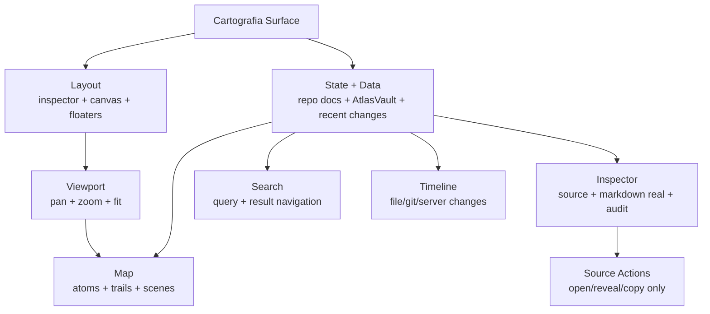

# ADR-0006 · Atlas Cartografia Surface Scalability Contract

Status: accepted · 2026-05-13

Este documento torna obrigatoria a arquitetura de escala da tela
`Cartografia` do Atlas Desktop. A Cartografia nao pode crescer como um unico
componente visual gigante. Ela e a interface navegavel da verdade canonica:
repo docs oficiais + AtlasVault real + arquivos markdown reais + audit do
grafo. Por isso precisa ser mais rigorosa que um canvas bonito.

Frase canonica:

```text
A Cartografia nao representa uma copia da verdade. Ela le a verdade onde ela
vive e torna essa verdade navegavel, auditavel e verificavel.
```

## Problema

A implementacao anterior estava concentrada em
`apps/desktop/src/components/cartografia/`. A fase 2 migrou a implementacao para
`apps/desktop/src/surfaces/cartografia/`. Os riscos abaixo continuam validos para
qualquer tentativa de recentralizar a tela:

- `CartografiaSurface.tsx` voltar a acumular layout, shortcuts, busca, resize,
  overlays, scenes e composicao;
- `Inspector.tsx` voltar a acumular source, ficha, markdown, acoes, timeline e
  resize;
- `Trails.tsx` voltar a concentrar geometria, DOM measurement e relacao visual;
- `cartografia.css` voltar a concentrar todo o sistema visual em um arquivo
  unico;
- subareas nascerem sem README local explicando boundaries, dono de estado,
  anti-patterns e caminho de refatoracao.

Sem contrato, a proxima feature tende a entrar no arquivo mais facil e a tela
vira um monolito visual dificil de validar.

## Decisao

Toda evolucao da Cartografia deve obedecer a este contrato:

```text
features novas entram em surfaces/cartografia/
components/cartografia/ permanece legado congelado
```

A Cartografia deve permanecer modular nesta estrutura:

```text
apps/desktop/src/surfaces/cartografia/
  CartografiaSurface.tsx
  CartografiaViewportSlot.tsx
  README.md
  layout/
  state/
  viewport/
  inspector/
  floaters/
  map/
  scenes/
  timeline/
  search/
  source/
  styles/
```

`components/cartografia/` nao deve receber feature nova. Se algo precisar
voltar para la, isso exige justificativa arquitetural explicita.

## Principios nao negociaveis

1. Fonte real sempre aparece.
   Cada peca visual precisa expor `graph_id`, `source`, `source_path` e estado
   de fonte. Se a fonte nao existe, a UI mostra ausencia, nunca conteudo
   inventado.

2. Cartografia e read-only.
   A surface pode abrir arquivo, revelar no Finder, copiar path e navegar. Ela
   nao escreve repo docs, nao escreve no AtlasVault e nao corrige frontmatter.

3. Repo e Vault nao sao sincronizados entre si.
   Repo docs sao autoridade tecnica. AtlasVault e segundo cerebro humano. A
   Cartografia le ambos, mas nao cria uma projecao duplicada.

4. O agente nao e fonte da verdade.
   A UI nao pode mostrar "documentado", "implementado", "sincronizado" ou
   "completo" baseado em frase do agente. Precisa vir de arquivo, frontmatter,
   git, mtime, audit ou endpoint.

5. Estado vazio honesto vence fallback bonito.
   Se `semantic_graph` vier vazio, a tela mostra vazio explicito. Fallback
   legado so pode existir se estiver rotulado como legado e nao parecer fonte
   canonica.

6. Navegacao e dado sao separados.
   Zoom, pan, foco, busca e breadcrumbs nao podem ficar misturados com fetch,
   cache de nota, adapter HTTP ou auditoria.

7. Inspector e leitura de arquivo.
   Inspector nao e painel decorativo; ele mostra o arquivo real, metadata real,
   source real, risco real e proxima acao real.

8. Layout nao pode esconder auditabilidade.
   Minimap, inspector, timeline, busca e canvas podem colapsar, mas nao podem
   remover fonte, path, estado de erro ou origem do dado.

9. Toda relacao visual precisa ter relacao de grafo.
   Linhas, trails, feedback loops e kin highlights precisam vir de
   `connections`, `semanticGraph.relations` ou relacoes normalizadas no client.

10. Cada subarea precisa de README antes de receber feature.
    Se uma pasta nova nasce sem contrato local, a feature esta incompleta.

## Modelo mental da tela



## Regioes canonicas

| Regiao | Papel | Pode sumir? |
|---|---|---|
| `inspector` | leitura canonica do node, arquivo e audit | Pode colapsar, nao perder estado |
| `resize` | divisoria ajustavel do inspector | Nao, enquanto houver inspector |
| `canvas` | mapa navegavel com pan/zoom | Nao |
| `floaters` | minimap, breadcrumb, busca, lentes, zoom | Podem colapsar individualmente |
| `timeline` | mudancas recentes reais | Pode ficar vazia, nao simulada |

Regra: feature nova precisa declarar uma destas regioes ou criar uma subarea
registrada. Nao existe feature "solta" dentro de `CartografiaSurface.tsx`.

`CartografiaSurface.tsx` e permitido apenas como composition root:

- chama hooks;
- passa props;
- conecta layout;
- nao calcula grafo;
- nao renderiza markdown;
- nao roteia geometry.

`CartografiaViewportSlot.tsx` monta somente a regiao navegavel: floaters,
world e overlay. Ele pode adaptar callbacks de UI, mas nao pode buscar dados,
parsear source nem calcular relacoes.

## Estrutura obrigatoria da fase 2

### `layout/`

Responsavel por grid, inspector/canvas, resize, colapso e composicao de slots.

Arquivos canonicos:

- `CartografiaLayout.tsx`
- `CartographyOverlay.tsx`
- `useInspectorColumn.ts`
- `useHorizontalResizeDrag.ts`
- `inspectorLayout.ts`
- `currentLocationLabel.ts`

Nao pode:

- fazer fetch;
- interpretar frontmatter;
- desenhar atom/trail;
- abrir arquivo externo.

### `state/`

Responsavel por graph, recent changes, note cache e maquina de estados.

Arquivos canonicos:

- `useCartografiaData.ts`
- `useCartografiaNavigation.ts`
- `cartografiaStateTypes.ts`
- `cartografiaSelectors.ts`
- `navigationModel.ts`
- `atomBuilders.ts`
- `shortcutModel.ts`

Implementacao atual:

- `useCartografia.ts`: composition root;
- `useCartografiaData.ts`: graph, recent changes, polling e erros;
- `useCartografiaNotes.ts`: note cache lazy;
- `useCartografiaNavigation.ts`: state machine de navegacao;
- `navigationModel.ts`: transicoes puras de navegacao;
- `atomIndex.ts`: indice O(1) de atoms;
- `atomBuilders.ts`: adapters puros para `CartographyAtom`;
- `browserStorage.ts`: API unica de persistencia local defensiva da Cartografia;
- `cartografiaTypes.ts`: contrato exportado;
- `useCartografiaViewModel.ts`: selectors derivados;
- `useCartografiaShortcuts.ts`: atalhos globais;
- `shortcutModel.ts`: protocolo puro de atalhos;
- `useVisualLens.ts`: hook de lente visual persistida;
- `visualLens.ts`: modelo puro de lente visual.

Nao pode:

- conter JSX;
- manipular DOM;
- importar CSS;
- decidir visual de atom.

### `viewport/`

Responsavel por pan, zoom, fit, transform e gestos.

Arquivos canonicos:

- `useCartografiaViewport.ts`
- `viewportMath.ts`
- `viewportTypes.ts`
- `useViewportPanBindings.ts`
- `viewportInteraction.ts`

Nao pode:

- carregar grafo;
- saber o que e repo/vault;
- alterar estado de inspector.

### `map/`

Responsavel por atom, trails, geometry, lenses e realce de relacoes.

Arquivos canonicos:

- `CartographyWorld.tsx`
- `WorldSceneSwitch.tsx`
- `WorldSceneRenderers.tsx`
- `worldSceneTypes.ts`
- `worldSceneModel.ts`
- `worldModel.ts`
- `Atom.tsx`
- `AtomVariants.tsx`
- `atomStyle.ts`
- `Trails.tsx`
- `TrailPrimitives.tsx`
- `trailGeometry.ts`
- `trailRouting.ts`
- `trailRouteModel.ts`
- `trailVisibility.ts`
- `trailShapes.ts`
- `trailLanes.ts`
- `trailMotion.ts`
- `trailPathBuilders.ts`
- `trailDom.ts`
- `trailTypes.ts`
- `useTrailPaths.ts`
- `atomModel.ts`
- `useAtomActivation.ts`
- `AtomSourceLine.tsx`
- `layout.ts`

Nao pode:

- buscar nota;
- abrir arquivo;
- fazer polling;
- escrever no store global diretamente.

### `floaters/`

Responsavel por controles flutuantes de orientacao e navegacao.

Arquivos canonicos:

- `CartographyFloaters.tsx`
- `Minimap.tsx`
- `minimapModel.ts`
- `Breadcrumb.tsx`
- `VisualLensToolbar.tsx`
- `ZoomControls.tsx`

Nao pode:

- fazer fetch;
- carregar markdown;
- abrir arquivo externo diretamente;
- manter estado global fora de preferencias locais;
- esconder fonte/path/erro que pertencem ao inspector.

### `scenes/`

Responsavel por `universe`, `system`, `flow`, `gear`, `subflow`.

Arquivos canonicos:

- `UniverseScene.tsx`
- `SystemScene.tsx`
- `SystemCard.tsx`
- `systemSceneModel.ts`
- `FlowScene.tsx`
- `FlowStageFrame.tsx`
- `FlowPipeline.tsx`
- `FlowLanes.tsx`
- `FlowLaneRegion.tsx`
- `flowModel.ts`
- `flowLaneModel.ts`
- `flowTypes.ts`
- `GearScene.tsx`
- `GearHeader.tsx`
- `GearSatellites.tsx`
- `GearFicha.tsx`
- `GearActions.tsx`
- `gearModel.ts`
- `gearTypes.ts`
- `SubflowScene.tsx`

Nao pode:

- implementar layout global;
- duplicar adapters de grafo;
- inventar node quando `semanticGraph` vier vazio.

### `inspector/`

Responsavel por leitura canonica do node focado.

Arquivos canonicos:

- `Inspector.tsx`
- `InspectorHeader.tsx`
- `InspectorResizeControls.tsx`
- `InspectorRows.tsx`
- `Ficha.tsx`
- `InspectorSections.tsx`
- `InspectorFileContent.tsx`
- `DefaultInspector.tsx`
- `DefaultInspectorContent.tsx`
- `RecentChangesDock.tsx`
- `buildFichaFields.ts`
- `inspectorModel.ts`
- `useInspectorNote.ts`
- `types.ts`

Nao pode:

- escrever arquivo;
- assinar receipt;
- criar proposta sem passar por fluxo/Kernel futuro;
- esconder `source_path`.

### `timeline/`

Responsavel por mudancas recentes.

Arquivos canonicos:

- `TimelinePanel.tsx`
- `TimelineFloater.tsx`
- `timelineFormat.ts`

Nao pode:

- simular evento recente;
- misturar mtime com commit sem source;
- atualizar `secondsAgo` como se fosse fonte canonica.

### `search/`

Responsavel por busca local no snapshot carregado.

Arquivos canonicos:

- `CartografiaSearch.tsx`
- `searchModel.ts`
- `searchScoring.ts`
- `useCartografiaSearch.ts`
- `types.ts`

Nao pode:

- disparar fetch global sem contrato;
- navegar para node inexistente;
- esconder quando nao ha resultados.

### `source/`

Responsavel por acoes read-only de fonte.

Arquivos canonicos:

- `sourceActions.ts`
- `sourcePath.ts`

Nao pode:

- escrever;
- mover arquivo;
- criar nota;
- abrir path sem validar `source`.

### `styles/`

Responsavel por dividir `cartografia.css`.

Arquivos canonicos:

- `cartografia.css`
- `00-work.css`
- `01-viewport-world.css`
- `02-trails.css`
- `03-regions.css`
- `04-atoms.css`
- `05-scenes.css`
- `06-floaters.css`
- `06-floaters-core.css`
- `07-floaters-controls.css`
- `08-inspector.css`
- `09-overlay-responsive.css`

Nao pode:

- conter estilo de Code;
- depender de DOM fora de `.cartografia-surface`;
- criar z-index global sem token/justificativa.

## Contratos de dados obrigatorios

Os tipos vivem em `packages/atlas-domain/src/cartography.ts`.

Qualquer mudanca em payload precisa atualizar:

1. `packages/atlas-domain/src/cartography.ts`;
2. adapter em `apps/desktop/src/lib/bridge.ts`;
3. este ADR ou ADR sucessor;
4. teste/fixture de adapter;
5. UI de erro para campo ausente.

Campos minimos para qualquer node:

| Campo | Obrigatorio | Motivo |
|---|---|---|
| `graphId` | Sim | identidade visual e navegacao |
| `name` ou `graphTitle` | Sim | legibilidade |
| `graphSource` | Sim | repo/vault/missing |
| `sourcePath` | Sim | verificabilidade |
| `missingSource` | Sim | vazio honesto |
| `graphLayer` | Para semantic nodes | zoom semantico |
| `graphParent` | Para semantic nodes | hierarquia |
| `depends/unblocks/flowsTo` | Quando existir | relacoes navegaveis |

## Contrato de source authority

| Conteudo | Fonte canonica | Como UI mostra |
|---|---|---|
| Arquitetura tecnica | repo docs | `source=repo`, path do repo, abrir editor/Finder |
| Segundo cerebro | AtlasVault | `source=vault`, abrir Obsidian/Finder |
| Agregado visual | atlas-server | `source=mixed`, nunca substituir path real |
| Node esperado sem arquivo | contrato/audit | `source=missing`, path esperado e proxima acao |

Regra: `mixed` nao pode ser usado para esconder ausencia de fonte. Se a peca
tem arquivo primario, deve apontar para `repo` ou `vault`.

## Contrato de estados

| Estado | UI obrigatoria |
|---|---|
| `loading` | overlay claro, sem mostrar mock como real |
| `offline` | erro acionavel com endpoint/fonte afetada |
| `empty graph` | mensagem de grafo vazio + audit |
| `missing source` | badge missing + path esperado |
| `note loading` | indicar arquivo sendo carregado |
| `note missing` | nao existe arquivo real |
| `note empty` | arquivo existe, corpo vazio |
| `recent empty` | sem mudancas recentes reais |

## Contrato de performance

Meta operacional:

- pan/zoom nao pode travar com 500 nodes;
- hover nao pode disparar fetch repetido;
- note fetch e lazy e cacheado por `graphId`;
- invalidacao de cache deve usar `modifiedAt` quando existir;
- trails devem recalcular por resize/layout, nao por todo keystroke;
- busca local precisa operar sobre indice normalizado.

Fase 2 deve separar selectors e view models para evitar recomputacao dentro de
componentes grandes.

## Contrato de acessibilidade e operacao

- `Escape` volta um nivel.
- `/` foca busca.
- `0` ajusta o mapa.
- Botoes precisam de `aria-label`.
- Controles iconicos precisam de tooltip.
- Colapsar inspector/minimap nao pode prender foco invisivel.
- Search result precisa ser navegavel por teclado.

## Anti-patterns proibidos

- Adicionar feature nova diretamente em `CartografiaSurface.tsx`.
- Adicionar feature nova diretamente em `Inspector.tsx`.
- Aumentar `cartografia.css` para resolver feature nova sem criar subarea.
- Criar novo fallback visual sem label de "legado" ou "sem fonte".
- Mostrar mock/hardcoded como se fosse dado canonico.
- Tratar Vault como copia da documentacao oficial.
- Fazer Cartografia escrever arquivo.
- Fazer uma action externa sem passar por `source/`.
- Criar path absoluto ad hoc dentro de componente visual.
- Criar z-index global sem escopo `.cartografia-surface`.

## Limites de arquivo para fase 2

Durante a refatoracao, estes limites passam a valer:

| Arquivo | Limite alvo |
|---|---|
| `CartografiaSurface.tsx` | ate 180 linhas |
| `Inspector.tsx` | ate 160 linhas |
| `Trails.tsx` | ate 220 linhas |
| qualquer scene | ate 220 linhas |
| qualquer hook | ate 220 linhas |
| CSS por arquivo | ate 500 linhas |

Se passar do limite, criar subcomponente, selector, primitive ou helper.

## Plano obrigatorio da fase 2

1. Criar `surfaces/cartografia/` com a estrutura deste ADR. Concluido.
2. Mover `CartografiaSurface.tsx` para a surface nova sem mudar comportamento. Concluido.
3. Extrair `layout/` e manter screenshot/visual equivalente. Concluido.
4. Extrair `state/` de `useCartografia`. Concluido.
5. Extrair `viewport/`. Concluido como subarea dedicada.
6. Extrair `inspector/`. Concluido.
7. Extrair `map/Trails` e geometry. Concluido.
8. Extrair `search/`, `timeline/`, `source/`. Concluido.
9. Dividir CSS. Concluido.
10. Transformar `components/cartografia/*` em fachadas legadas ou remover. Concluido como pasta congelada.

Cada passo precisa passar:

```bash
npm run build
git diff --check
```

Quando tocar bridge/adapters:

```bash
npm run build
cargo check --workspace
git diff --check
```

## Definition of Done da refatoracao

- `apps/desktop/src/surfaces/cartografia/` contem a implementacao real.
- `components/cartografia/` nao recebe feature nova.
- Existem READMEs em todas as subareas.
- `CartografiaSurface.tsx` vira composicao, nao centro de logica.
- Inspector e dividido por responsabilidade.
- CSS deixa de ser monolito.
- State/data/viewport/source/actions ficam separados.
- Nenhum comportamento read-only foi quebrado.
- Nenhum fallback inventado foi introduzido.
- `npm run build` passa.
- `git diff --check` passa.

## Estado atual da fase 2

Ja foi realizado:

- implementacao real em `apps/desktop/src/surfaces/cartografia/`;
- `CartografiaSurface.tsx` reduzido para composition root com
  `CartografiaViewportSlot` e `CartografiaInspectorSlot`;
- `layout/` separado para shell, overlay, largura do inspector e label atual;
- `state/` separado para dados, note cache, navegacao, atom index, view model, atalhos e lente visual;
- `search/` separado em hook + componente + scoring;
- `map/` separado para world, scene switch, scene renderers, scene types, atom, atom model, source line, click protocol, renderer de trails, hook de paths, DOM measurement, lanes, motion, path builders e roteamento;
- `scenes/flow` quebrado em frame, pipeline, lanes, model e types;
- `scenes/gear` quebrado em header, satellites, ficha, actions, model e types;
- `floaters/` separado para breadcrumb, minimap, lentes, busca e zoom;
- `source/` separado entre action read-only e resolucao deterministica de path;
- `viewport/` separado em composition root, refit semantico, matematica pura, bindings e tipos;
- `timeline/`, `inspector/` com boundaries documentados.

Ainda aceitamos temporariamente:

- polling em vez de SSE.

Esta condicao e divida tecnica documentada. Ela nao autoriza novas features
grandes fora das subareas canonicas.
